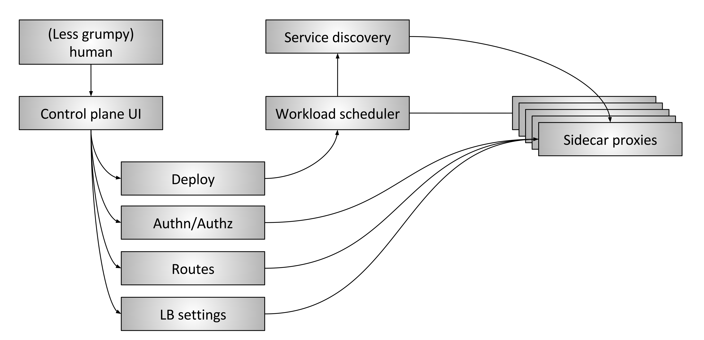

# Envoy Service Mesh

---

<!-- paginate: true -->

# Envoy

*high performance C++ distributed proxy, designed as a service mesh*

- **L3/L4 proxy** - TCP proxy at its core. Supports MongDb, Redis, stunnel replacement, TCP rate limiting etc
- **L7 proxy** - HTTP/2 first! Understands gRPC + gRPC HTTP/1.1 bridge
- **Advanced Load Balancing** - automatic retries, circuit breaking, rate limiting etc
- **Observability** - stats, logs, tracing

---

# Service Mesh

- **data plane:** the pathway which data travels for network connections. E.g.  NGINX, HAProxy, Envoy

- **control plane:** provides rules and configuration for data plane. E.g. Istio, Consul

---

# Data Plane

Side-car proxy handles the following functions

- Service discovery
- Health checking
- Routing
- Load balancing
- Authentication & Authorization
- Observability

---

# Control Plane

*control plane sets policy to be enacted by the data plane*

